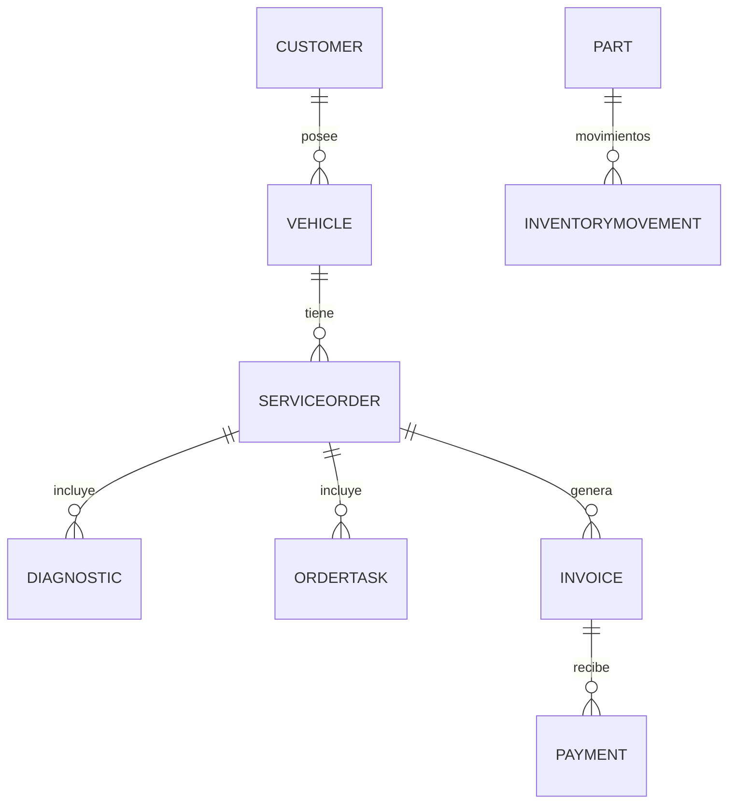

# Taller Mecánico — Plataforma Full‑Stack (API .NET 8 + Frontend React/Vite)

Sistema para la gestión de un **taller mecánico** con autenticación JWT, administración de clientes y vehículos, órdenes de servicio, inventario y alertas por stock mínimo. Incluye **backend en .NET 8** con Entity Framework Core (SQL Server) y **frontend en React (Vite)**.

---

## 🧭 Tabla de contenido
- [Arquitectura](#arquitectura)
- [Tecnologías](#tecnologías)
- [Estructura del repositorio](#estructura-del-repositorio)
- [Requisitos](#requisitos)
- [Configuración](#configuración)
  - [Backend (API .NET 8)](#backend-api-net-8)
  - [Frontend (React + Vite)](#frontend-react--vite)
- [Ejecución rápida](#ejecución-rápida)
- [Base de datos y migraciones](#base-de-datos-y-migraciones)
- [Usuarios iniciales (seed manual)](#usuarios-iniciales-seed-manual)
- [Endpoints de la API](#endpoints-de-la-api)
- [Modelo de datos](#modelo-de-datos)
- [Seguridad y CORS](#seguridad-y-cors)
- [Registro y observabilidad](#registro-y-observabilidad)
- [Contenerización (opcional)](#contenerización-opcional)
- [Despliegue (ideas)](#despliegue-ideas)
- [Solución de problemas](#solución-de-problemas)
- [Licencia](#licencia)

---

## Arquitectura

```
React (Vite) ──► API Gateway (.NET 8 Web API)
                   ├── Autenticación JWT (Bearer)
                   ├── EF Core (SQL Server)
                   └── Serilog (logs)
                         │
                         ▼
                    SQL Server
```

- La **aplicación cliente** consume endpoints REST autenticados con **JWT**.
- La **capa de datos** usa EF Core con **migraciones**.
- **Serilog** registra la actividad de la API.

---

## Tecnologías

**Backend**
- .NET 8, ASP.NET Core Web API
- Entity Framework Core 8 (SqlServer, Tools, Design)
- Autenticación **JWT** (`Microsoft.AspNetCore.Authentication.JwtBearer`)
- **BCrypt.Net-Next** para verificación de contraseñas
- **Serilog.AspNetCore**
- **Swashbuckle** (Swagger UI)

**Frontend**
- React 18 + Vite 5
- React Router 6
- Bootstrap 5
- SweetAlert2

---

## Estructura del repositorio

```
taller-mecanico/
├── backend/
│   └── Workshop.Api/
│       ├── Controllers/
│       │   ├── AuthController.cs
│       │   ├── CustomersController.cs
│       │   ├── VehiclesController.cs
│       │   ├── ServiceOrdersController.cs
│       │   ├── PartsController.cs
│       │   └── InventoryController.cs
│       ├── Data/
│       │   └── AppDbContext.cs
│       ├── DTOs/
│       │   ├── AuthDtos.cs
│       │   └── CommonDtos.cs
│       ├── Migrations/
│       ├── Models/
│       │   ├── Appointment.cs
│       │   ├── AuditLog.cs
│       │   ├── Customer.cs
│       │   ├── Diagnostic.cs
│       │   ├── InventoryMovement.cs
│       │   ├── Invoice.cs (incluye Payment)
│       │   ├── OrderTask.cs
│       │   ├── Part.cs
│       │   ├── Role.cs
│       │   ├── ServiceOrder.cs
│       │   ├── User.cs
│       │   └── Vehicle.cs
│       ├── Program.cs
│       ├── appsettings.json
│       └── Workshop.Api.csproj
└── frontend/
    ├── index.html
    └── src/
        ├── api/client.js
        ├── App.jsx / main.jsx / index.css
        ├── context/AuthContext.jsx
        ├── components/Protected.jsx, BackToDashboard.jsx
        └── pages/
            ├── Login.jsx
            ├── Dashboard.jsx
            ├── Customers.jsx
            ├── Vehicles.jsx (dentro de Orders.jsx se gestiona vehículo/orden)
            ├── Orders.jsx
            ├── Inventory.jsx
            └── Appointments.jsx
```

---

## Requisitos

- **SDK .NET 8** (8.x)
- **Node.js** 18+ y npm
- **SQL Server** (local o remoto; habilitar TCP/IP y certificados si aplica)

---

## Configuración

### Backend (API .NET 8)

Archivo: `backend/Workshop.Api/appsettings.json`

```json
{
  "ConnectionStrings": {
    "DefaultConnection": "Server=.;Database=WorkshopDb;Trusted_Connection=True;TrustServerCertificate=True;MultipleActiveResultSets=true"
  },
  "Jwt": {
    "Key": "REEMPLAZAR_CON_UNA_LLAVE_SECRETA_LARGA_SEGURA",
    "Issuer": "Workshop.Api",
    "Audience": "Workshop.Client"
  },
  "Cors": {
    "Origins": "http://localhost:5173;http://localhost:3000"
  },
  "Serilog": {
    "MinimumLevel": "Information",
    "WriteTo": [{ "Name": "Console" }]
  },
  "AllowedHosts": "*"
}
```

**Variables clave**
- `ConnectionStrings:DefaultConnection`: cadena de conexión a **SQL Server**.
- `Jwt:Key`: secreto **largo y aleatorio** (mín. 32 bytes).
- `Jwt:Issuer` y `Jwt:Audience`: identificadores para validar tokens.
- `Cors:Origins`: orígenes permitidos separados por `;`.

> Swagger se habilita en Development. La API usa **JWT Bearer** y política CORS `frontend` definida en `Program.cs`.

### Frontend (React + Vite)

Variables de entorno (archivo `.env` en `frontend/`):

```
VITE_API_URL=http://localhost:(Varia segun el puerto en el que se configure)/api/v1
```

> Si no se define, por defecto el cliente usa `https://localhost:(Varia segun el puerto en el que se configure)/api/v1` (ver `src/api/client.js`).

---

## Ejecución rápida

### 1) Backend
```bash
cd backend/Workshop.Api

# Restaurar dependencias
dotnet restore

# Aplicar migraciones (crea DB y esquema)
dotnet tool install --global dotnet-ef
dotnet ef database update

# Ejecutar
dotnet run
# Swagger: http://localhost:(Varia segun el puerto en el que se configure)/swagger  (según perfil/puerto)
```

### 2) Frontend
```bash
cd frontend
npm install
npm run dev
# Abre http://localhost:5173
```

---

## Base de datos y migraciones

- EF Core con migraciones en `backend/Workshop.Api/Migrations` (ej. `20250913182126_Initial`).
- Tablas principales: `Users`, `Customers`, `Vehicles`, `ServiceOrders`, `Diagnostics`, `OrderTasks`, `Parts`, `InventoryMovements`, `Invoices`, `Payments`, `Appointments`, `AuditLogs`.
- Relaciones destacadas:
  - **Customer 1─* Vehicle**
  - **Vehicle 1─* ServiceOrder**
  - **ServiceOrder 1─* Diagnostic / OrderTask / Invoice**
  - **Invoice 1─* Payment**
  - **Part 1─* InventoryMovement**

> Si cambias el modelo, crea una nueva migración con `dotnet ef migrations add <Nombre>` y aplica con `dotnet ef database update`.

---

## Usuarios iniciales (seed manual)

El login del frontend muestra por defecto **admin@example.com / Admin123***. La API **no incluye seed automático**, por lo que debes insertar un usuario manualmente:

1) Genera un hash **BCrypt** para la contraseña (ejemplo con 12 rounds):

```
{hashed}
```

> Puedes generar otro hash con: C# (`BCrypt.Net.BCrypt.HashPassword("Admin123*")`), PowerShell, o Python.

2) Inserta el usuario en SQL Server:

```sql
INSERT INTO Users (Id, Name, Email, PasswordHash, Role, IsActive, CreatedAt)
VALUES (NEWID(), 'Administrador', 'admin@example.com',
        '{hashed}',
        'Admin', 1, GETUTCDATE());
```

> Roles disponibles indicados en `User.cs`: `Admin`, `Recepcionista`, `Mecanico`, `Gerente`.

---

## Endpoints de la API

Prefijo común: `/api/v1`  
**Autenticación**: Bearer JWT en `Authorization: Bearer <token>`  
**Formato**: `application/json`

### Autenticación
- **POST** `/auth/login`  
  Body: `{ "email": "admin@example.com", "password": "Admin123*" }`  
  Respuesta: `{ "token": "...", "name": "...", "role": "Admin", "email": "..." }`

### Clientes
- **GET** `/customers?q=&page=1&pageSize=20` — listado + búsqueda
- **POST** `/customers` — crear (`CustomerCreateDto`)
- **GET** `/customers/{id}` — detalle (incluye vehículos)

### Vehículos
- **POST** `/vehicles` — crear (`VehicleCreateDto`)
- **GET** `/vehicles/search?plate=ABC123` — buscar por placa

### Órdenes de servicio
- **POST** `/serviceorders` — crear (`ServiceOrderCreateDto`)
- **GET** `/serviceorders?state=&page=&pageSize=` — listar/paginar
- **PATCH** `/serviceorders/{id}/state` — cambiar estado  
  Estados (`OrderState`): `Draft`, `Diagnostic`, `Quoted`, `Approved`, `InProgress`, `Finished`, `Closed`

### Repuestos
> Requiere roles `Admin` o `Gerente`.
- **GET** `/parts` — listar
- **POST** `/parts` — crear (`Part`)

### Inventario
- **POST** `/inventory/movement` — registrar movimiento (`InventoryMovement`)  
  Tipos (`MovementType`): `In`, `Out`, `Return`, `Adjustment`
- **GET** `/inventory/alerts` — alertas por **stock ≤ minStock**

---

## Modelo de datos

> Resumen de entidades y relaciones principales.



Campos relevantes (extracto):
- `Customer`: `FullName`, `Phone`, `Email`, `Address`, `CreatedAt`
- `Vehicle`: `Plate`, `Brand`, `Model`, `Year`, `CustomerId`
- `ServiceOrder`: `State`, `Odometer`, `ReceptionNotes`, `LaborSubtotal`, `PartsSubtotal`, `Taxes`, `Total`, `CreatedAt`
- `Part`: `Sku`, `Name`, `UnitCost`, `Stock`, `MinStock`
- `InventoryMovement`: `PartId`, `Type`, `Quantity`, `UnitCost`, `Reason`, `ServiceOrderId?`
- `Invoice`: `Subtotal`, `Taxes`, `Total`, `IssuedAt`
- `Payment`: `Method`, `Amount`, `PaidAt`
- `User`: `Name`, `Email`, `PasswordHash`, `Role`, `IsActive`

---

## Funcionalidades del frontend

- **Login**: formulario de acceso; guarda `{ token, name, role, email }` en `localStorage` (`tm.auth`).
- **Dashboard**: tarjetas/resumen de órdenes, inventario y accesos rápidos.
- **Customers**: listado, búsqueda y creación de clientes.
- **Orders**: creación de órdenes (vehículo existente), listado por estado y cambio de estado.
- **Inventory**: creación de repuestos, movimientos de inventario y **alertas** por stock mínimo.
- **Appointments**: agenda básica (estructura lista para extender).

> Las rutas están protegidas por `Protected.jsx`. Si no hay sesión válida, redirige a `/login`.
